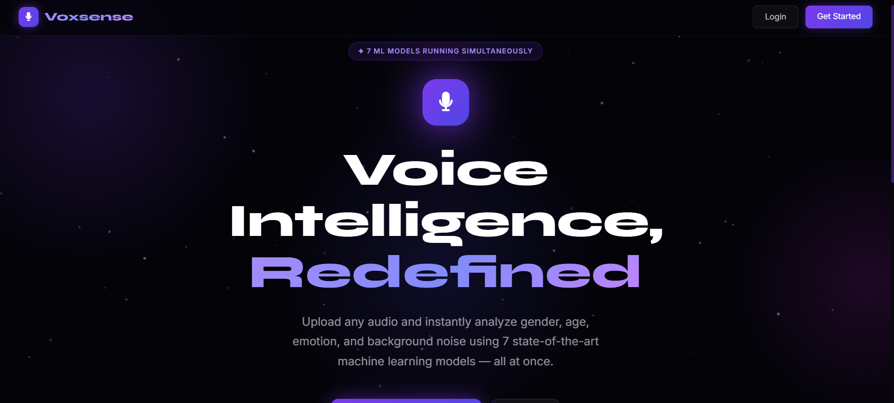
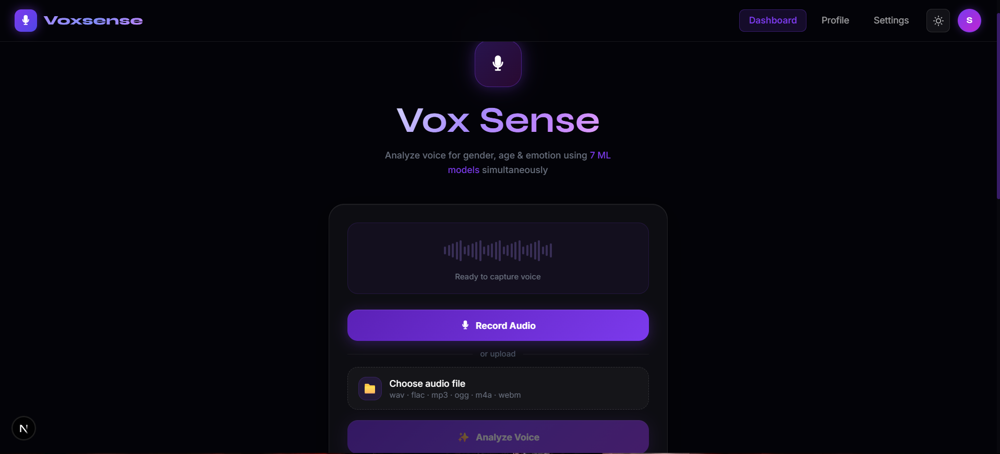
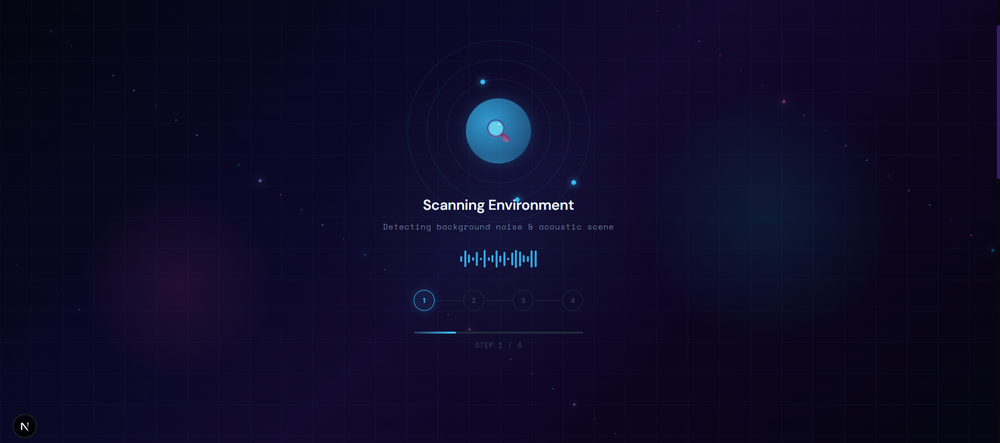
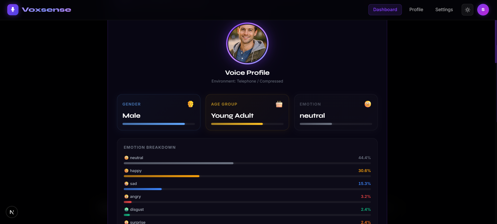

<div align="center">

```
██╗   ██╗ ██████╗ ██╗  ██╗███████╗███████╗███╗   ██╗███████╗███████╗
██║   ██║██╔═══██╗╚██╗██╔╝██╔════╝██╔════╝████╗  ██║██╔════╝██╔════╝
██║   ██║██║   ██║ ╚███╔╝ ███████╗█████╗  ██╔██╗ ██║███████╗█████╗  
╚██╗ ██╔╝██║   ██║ ██╔██╗ ╚════██║██╔══╝  ██║╚██╗██║╚════██║██╔══╝  
 ╚████╔╝ ╚██████╔╝██╔╝ ██╗███████║███████╗██║ ╚████║███████║███████╗
  ╚═══╝   ╚═════╝ ╚═╝  ╚═╝╚══════╝╚══════╝╚═╝  ╚═══╝╚══════╝╚══════╝
```

**Voice Intelligence, Redefined.**

*Upload any audio. Instantly analyze gender, age, emotion, and background noise using 7 state-of-the-art ML models — all at once.*

[](https://voxsense.vercel.app)
[](https://voxsense-ruu2.onrender.com/docs)
[](https://github.com/Cenizas036/voxsense)
[](https://huggingface.co/Sanket036/voxsense)


</div>

---

## 🎯 What is Voxsense?

Voxsense is a **full-stack AI voice analysis platform** that runs **7 machine learning models simultaneously** on any uploaded audio file. In under 5 seconds, it extracts:

- 🧬 **Speaker Gender** — CNN + pitch extraction + spectral analysis fusion
- 👴 **Speaker Age Group** — Deep neural network with acoustic fallback
- 😤 **Emotion Detection** — Multi-class emotion classifier (neutral, happy, angry, sad, fearful, disgusted, surprised)
- 🎵 **Song vs. Speech** — 4-stage hybrid acoustic + CNN pipeline
- 🌫️ **Noise Environment** — Scene classification + noise type detection
- 🤝 **Friend Model Comparison** — Ensemble of SVM, XGBoost, Random Forest, LSTM, Transformer-CNN, Attentive-LSTM voting on the same audio
- 📊 **Waveform + Spectrogram** — Real-time visualization of the audio signal

Everything runs in a **single API call**. No queue. No waiting. No black box.

---

## 📸 Screenshots

<div align="center">

| Landing Page | Dashboard |
|:---:|:---:|
|  |  |

| Loading Screen | Model Comparison |
|:---:|:---:|
|  |  |

</div>

---

## 🏗️ Architecture

```
┌─────────────────────────────────────────────────────────────────┐
│                        FRONTEND (Vercel)                        │
│                   Next.js 15 · TypeScript · Tailwind            │
│            Audio Upload → Waveform Preview → Results UI         │
└──────────────────────────┬──────────────────────────────────────┘
                           │  POST /analyze-audio
                           ▼
┌─────────────────────────────────────────────────────────────────┐
│                    BACKEND (Render / HF Spaces)                 │
│                    FastAPI · Uvicorn · Python 3.11               │
│                                                                 │
│  ┌─────────────────────────────────────────────────────────┐   │
│  │                   INFERENCE PIPELINE                     │   │
│  │                                                         │   │
│  │  RAW AUDIO → ENHANCE → EXTRACT NOISE → DETECT NOISE    │   │
│  │       ↓                                                 │   │
│  │  EXTRACT VOICE                                          │   │
│  │       ↓                                                 │   │
│  │  ┌──────────┐ ┌──────────┐ ┌──────────┐ ┌──────────┐  │   │
│  │  │  Gender  │ │   Age    │ │ Emotion  │ │Song/Spch │  │   │
│  │  │  Model   │ │  Model   │ │  Model   │ │  (CNN)   │  │   │
│  │  └──────────┘ └──────────┘ └──────────┘ └──────────┘  │   │
│  │       ↓              ↓           ↓             ↓       │   │
│  │  ┌─────────────────────────────────────────────────┐   │   │
│  │  │         FRIEND MODEL ENSEMBLE COMPARISON        │   │   │
│  │  │  SVM · XGBoost · RF · LSTM · Transformer-CNN   │   │   │
│  │  │           Attentive-LSTM · Majority Vote        │   │   │
│  │  └─────────────────────────────────────────────────┘   │   │
│  └─────────────────────────────────────────────────────────┘   │
└─────────────────────────────────────────────────────────────────┘
                           │
                           ▼
┌─────────────────────────────────────────────────────────────────┐
│                   MODEL WEIGHTS (HuggingFace LFS)               │
│              huggingface.co/Sanket036/voxsense                  │
│     6.39 GB · 27 files · .pth + .joblib · Auto-downloaded       │
└─────────────────────────────────────────────────────────────────┘
```

---

## 🤖 ML Models — Deep Dive

### 1. Gender Classification
**Approach:** 3-stage fusion system
- **Stage 1 — CNN:** Custom `GenderModel` trained on mel-spectrograms (128 mel bands, 216 time frames)
- **Stage 2 — Pitch Extraction:** `librosa.pyin` F0 tracking with voiced fraction analysis
- **Stage 3 — Spectral Scoring:** Low/high energy ratio + spectral centroid thresholding
- **Fusion Logic:** Pitch overrides CNN in clear frequency ranges (< 130 Hz → Male, > 215 Hz → Female); spectral score acts as tiebreaker in the 165–215 Hz ambiguous zone
- **Model Size:** 28.8 MB (`gender_model_v2.pth`)

### 2. Age Group Detection
- CNN-based classifier predicting child / young adult / adult / senior
- Acoustic fallback when model confidence is low
- Trained on mel-spectrogram features

### 3. Emotion Recognition
- 7-class classifier: neutral, happy, angry, sad, fearful, disgusted, surprised
- Returns per-class probability breakdown for the UI
- Powers per-segment emotion annotation via `/analyze-segments` endpoint

### 4. Song vs. Speech — 4-Stage Hybrid Pipeline
The most complex model in the system. Runs acoustic detection stages in order, only falling back to the CNN when needed:

| Stage | Method | Triggers When |
|-------|--------|---------------|
| **0** | Strong Music Detector | Beat regularity + chroma stability + harmonic ratio + tonal fraction ≥ 0.60 combined score |
| **1** | Speech Veto | High flatness / ZCR / erratic pitch / low harmonic dominance → immediately returns "speech" |
| **2** | Music Confidence Score | Geometric mean of 4 acoustic votes |
| **3** | CNN Confirmation | Only for ambiguous zone (0.55–0.75 confidence); `SongSpeechModel` CNN confirms or overrides |
| **4** | Strong Music Signal | Acoustics alone sufficient (conf ≥ 0.75) |

### 5. Noise Environment Detection
- Scene classification (indoor / outdoor / vehicle / etc.)
- Noise type identification (white noise, crowd, traffic, machinery, etc.)
- Operates on the **noise residual** extracted from enhanced audio (not the raw signal)
- Returns `is_clean` flag + per-class noise breakdown

### 6. Friend Model Ensemble
6 independent models analyze the same audio and vote via majority:
- **Classical ML:** SVM, XGBoost, Random Forest (gender / age / emotion variants)
- **Deep Learning:** LSTM, Transformer-CNN, Attentive-LSTM
- Each outputs gender + age_label + emotion; majority vote shown alongside main model
- Total joblib model weights: ~3.5 GB

---

## 🛠️ Tech Stack

### Frontend
| Technology | Purpose |
|------------|---------|
| **Next.js 15** | React framework, SSR, routing |
| **TypeScript** | Type safety across the entire frontend |
| **Tailwind CSS** | Utility-first styling |
| **Vercel** | Production deployment with CI/CD on push |

### Backend
| Technology | Purpose |
|------------|---------|
| **FastAPI** | Async REST API, automatic OpenAPI/Swagger docs |
| **Uvicorn** | ASGI server |
| **PyTorch 2.x** | CNN model inference |
| **librosa** | Audio feature extraction (mel, MFCC, chroma, pitch) |
| **scikit-learn** | SVM / preprocessing |
| **XGBoost** | Gradient boosted tree models |
| **scipy** | Signal processing (butterworth filters, etc.) |
| **soundfile / noisereduce** | Audio I/O and noise reduction |
| **openai-whisper** | Speech transcription (segment analysis) |
| **matplotlib** | Waveform + spectrogram plot generation |

### Infrastructure
| Service | Role |
|---------|------|
| **Vercel** | Frontend hosting |
| **Render** | Backend API hosting |
| **HuggingFace Hub** | 6.39 GB model weights storage (LFS) |
| **GitHub** | Source control + CI trigger |

---

## 📡 API Reference

### `POST /analyze-audio`
Analyze a full audio file.

**Request:** `multipart/form-data`
| Field | Type | Description |
|-------|------|-------------|
| `file` | `File` | Audio file (mp3, wav, ogg, m4a, etc.) |
| `has_transcript` | `string` | `"true"` if audio has speech content |
| `source` | `string` | `"upload"` or `"record"` |

**Response:**
```json
{
  "type": "speech",
  "audio_environment": "indoor_quiet",
  "gender": { "label": "Male", "confidence": 91.2 },
  "age": { "label": "Young Adult", "confidence": 78.5 },
  "emotion": {
    "label": "neutral",
    "confidence": 82.3,
    "breakdown": { "neutral": 82.3, "happy": 9.1, "angry": 4.2, ... }
  },
  "song_speech": { "label": "speech", "confidence": 88.0 },
  "noise_detail": {
    "scene": "indoor",
    "noise_type": "background_hum",
    "is_clean": false,
    "noise_breakdown": { ... }
  },
  "model_comparison": {
    "svm": { "gender": "Male", "age_label": "Young Adult", "emotion": "neutral" },
    "xgb": { ... },
    "lstm": { ... }
  },
  "majority_vote": { "gender": "Male", "age": "Young Adult", "emotion": "neutral" },
  "plot_url": "/static/plots/abc123.png",
  "avatar_url": "/static/images/youngm.png"
}
```

### `POST /analyze-segments`
Analyze emotion per transcript segment (for annotated transcripts).

**Request:** `multipart/form-data`
| Field | Type | Description |
|-------|------|-------------|
| `file` | `File` | Audio file |
| `segments` | `string` | JSON array of `{start, end, text}` |

---

## 🚀 Running Locally

### Prerequisites
- Python 3.11+
- Node.js 18+
- ~7 GB disk space for model weights

### Backend Setup

```bash
# Clone the repo
git clone https://github.com/Cenizas036/voxsense.git
cd voxsense/backend

# Create virtual environment
python -m venv venv
source venv/bin/activate  # Windows: venv\Scripts\activate

# Install dependencies
pip install -r requirements.txt

# Download model weights from HuggingFace
python -c "
from huggingface_hub import hf_hub_download
import os
# Download models from Sanket036/voxsense
# Place in gender/, age/, emotion/, song_speech/, noise_models/, friend_models/
"

# Start the server
uvicorn app:app --host 0.0.0.0 --port 10000 --reload
```

Backend will be live at `http://localhost:10000`
Swagger docs at `http://localhost:10000/docs`

### Frontend Setup

```bash
cd voxsense/frontend

# Install dependencies
npm install

# Set environment variable
echo "NEXT_PUBLIC_API_URL=http://localhost:10000" > .env.local

# Start dev server
npm run dev
```

Frontend will be live at `http://localhost:3000`

---

## 📁 Project Structure

```
voxsense/
├── frontend/                     # Next.js app (deployed on Vercel)
│   ├── app/
│   ├── components/
│   └── ...
│
└── backend/                      # FastAPI app (deployed on Render)
    ├── app.py                    # Main FastAPI entry point
    ├── audio_utils.py            # Raw audio loading
    ├── audio_cleaning.py         # Enhancement, noise extraction, voice separation
    ├── visualization.py          # Waveform + spectrogram plotting
    │
    ├── gender/
    │   ├── inference_gender.py   # 3-stage gender fusion (CNN + pitch + spectral)
    │   └── gender_model.pth      # Model weights (via HuggingFace)
    │
    ├── age/
    │   ├── inference_age.py
    │   └── age_model.pth
    │
    ├── emotion/
    │   ├── inference_emotion.py
    │   └── emotion_model.pth
    │
    ├── song_speech/
    │   ├── inference_cnn.py      # 4-stage hybrid song/speech pipeline
    │   └── cnn_song_speech.pth
    │
    ├── noise_models/
    │   ├── inference_noise.py
    │   └── best_model.pt
    │
    ├── friend_models/
    │   ├── inference_friend.py   # 6-model ensemble comparison
    │   ├── svm_*.joblib          # SVM variants
    │   ├── xgb_*.joblib          # XGBoost variants
    │   ├── rf_*.joblib           # Random Forest variants
    │   ├── lstm.pth
    │   ├── transformer_cnn.pth
    │   └── attentive_lstm.pth
    │
    ├── models/                   # PyTorch model class definitions
    │   ├── gender_model.py
    │   ├── age_model.py
    │   ├── emotion_model.py
    │   └── song_speech_model.py
    │
    ├── static/
    │   ├── plots/                # Generated waveform/spectrogram PNGs
    │   └── images/               # Avatar images
    │
    └── requirements.txt
```

---

## 🧪 Key Engineering Decisions

**Why a 4-stage song/speech pipeline instead of just the CNN?**
The CNN alone misclassifies vocal-heavy songs as speech (since vocals look like speech to the model). Stage 0's acoustic music detector catches these before the speech veto fires — combining acoustic priors with neural confirmation only in genuinely ambiguous cases.

**Why acoustic fallbacks on every model?**
The `.pth` files are not committed to git (they're 270 MB+). On cold deploys or free-tier hosts where models fail to load, the app must still return *something* meaningful rather than a 500 error. Every inference file follows the `model = None / try: load / except: fallback` pattern.

**Why HuggingFace for model storage?**
Git LFS on GitHub works but Render can't run `git lfs pull` natively. HuggingFace Hub provides a `hf_hub_download` API that works inside Docker builds without LFS tooling, and it's designed for large model files.

**Why separate noise residual extraction before noise detection?**
Running noise detection on the raw or voice-enhanced audio confuses the model — it detects the *voice* as the dominant signal rather than the *background*. Extracting `enhanced - voice = noise residual` first isolates what we actually want to classify.

---

## 🤝 Contributing

Pull requests are welcome. For major changes, open an issue first to discuss what you'd like to change.

```bash
# Fork the repo, then:
git checkout -b feature/your-feature-name
git commit -m "feat: add your feature"
git push origin feature/your-feature-name
# Open a PR on GitHub
```

---

## 👤 Author

**Sanket** — [@Cenizas036](https://github.com/Cenizas036)

Built as a mini project exploring multi-model audio intelligence pipelines, production ML deployment, and full-stack AI systems.

---

<div align="center">

*If this project helped you or impressed you, consider giving it a ⭐*

**[voxsense.vercel.app](https://voxsense.vercel.app)**

</div>
